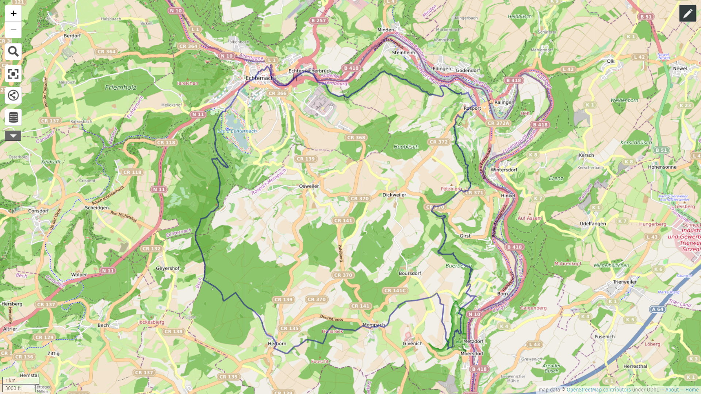

# Voorbereidingen Mullerthal trail

Won't do the 3 loops separately, but in 6 parts along the loops: Start
of at loop 1, clockwise, then part 1 of loop2, counter clockwise, 1st
part of loop 3 counterclockwise, part 2 of loop 3 counter clockwise, 2nd
part of loop 2 counter clockwise.

Arrival @Echternach:

- Parking Bénédictins
- Parking A Kack

Camping:

- [Country Camp camping Echternacherbrück](https://echternacherbrueck.de/?lang=nl)
- [WOLLEFSSCHLUCHT](https://www.visitechternach.lu/nl/camping/de-oficiele-camping)

Day 1: Echternach - Metzdorf

- Camping Deulux
- Camping Alter Bahnhof Metzdorf

Day 2: Metzdorf - Echternach

Day 3: Echternach - Mullerthal

- Camper parkeerplaats zonder voorzieningen
- [Hôtel-Restaurant Le Cigalon](https://lecigalon.lu/nl/)
- Mullerthal Cascades

Day 4: Mullerthal - Larochette

- Camping Auf Kengert (3,26km van route)
- WTMG: [https://welcometomygarden.org/explore/garden/PwZuSylidjM8NTZ41HxXy3nNvFs2](https://welcometomygarden.org/explore/garden/PwZuSylidjM8NTZ41HxXy3nNvFs2)

Day 5: Larochette - Mullerthal

Day 6: Mullerthal - Echternach

[[docs/hiking/voorbereidingen/index|Terug naar voorbereidingen]] | [[docs/hiking/index|Terug naar hiking]] | [[docs/index|Startpagina]]

[//begin]: # "Autogenerated link references for markdown compatibility"
[docs/hiking/voorbereidingen/index|Terug naar voorbereidingen]: ../index "Voorbereidingen wandelingen"
[docs/hiking/index|Terug naar hiking]: ../../index "Hiking"
[docs/index|Startpagina]: ../../../index "Stoops Foamnotes"
[//end]: # "Autogenerated link references"
