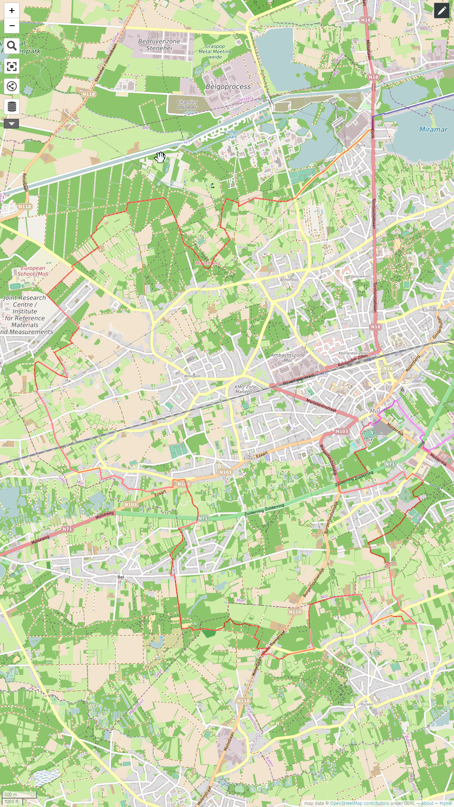
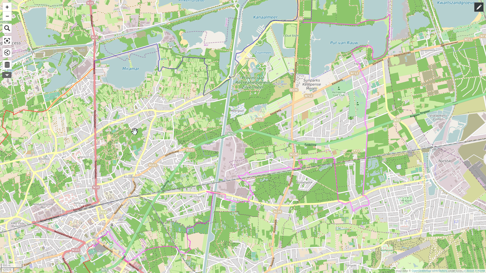
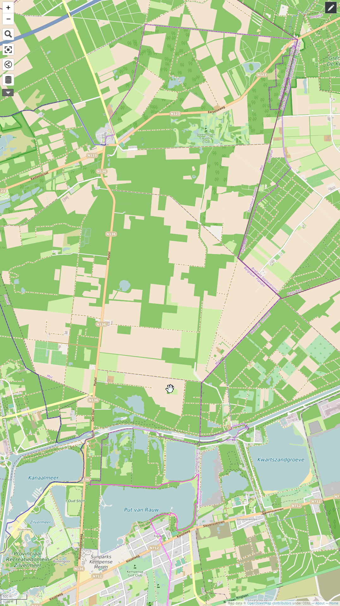
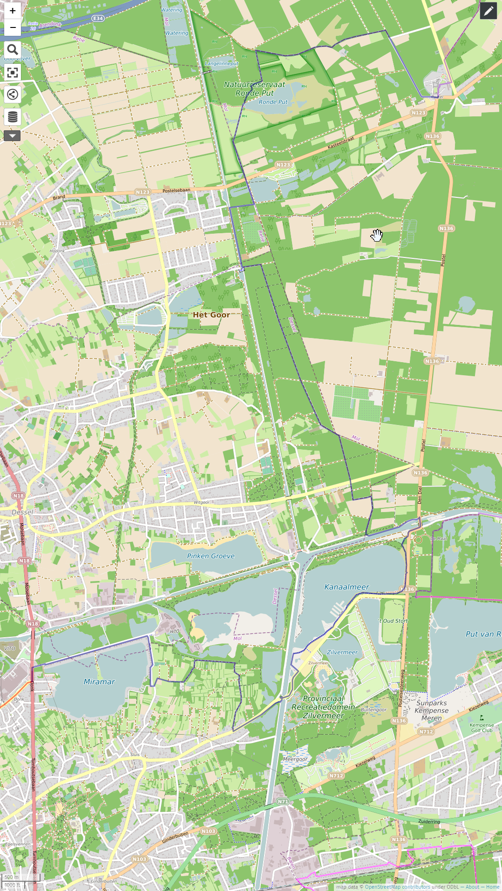

# Streek-GR Mol Om

## Deel 1

([GPX](http://diskstation.home.taurus/wikidata/sgrmolom1.gpx))

Track: [Etappe 1](https://www.afstandmeten.nl/index.php?id=3279268)

## Deel 2

([GPX](http://diskstation.home.taurus/wikidata/sgrmolom2.gpx))

## [Deel 3](Stoopswiki:Hiking:voorbereidingen:streekgrmolom:deel3 "wikilink")

([GPX](http://diskstation.home.taurus/wikidata/sgrmolom3.gpx))

## Deel 4

([GPX](http://diskstation.home.taurus/wikidata/sgrmolom4.gpx))

[[docs/hiking/voorbereidingen/index|voorbereidingen]]

[//begin]: # "Autogenerated link references for markdown compatibility"
[docs/hiking/voorbereidingen/index|voorbereidingen]: ../index "Voorbereidingen wandelingen"
[//end]: # "Autogenerated link references"
