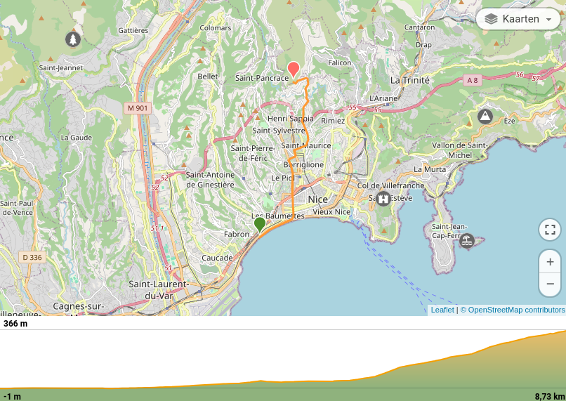

# Dag 1: 08/08/2019

## Vlucht

Eindhoven - Nice

## Nice - Aire St. Michel
Na het landen 's avonds, vertrokken we direct richting de rand van Nice om een slaapplaats te zoeken.\
Een toch wel pittige wandeling langs de zeedijk in Nice, daarna stilaan naar omhoog, tot naar de buitenwijken, waar de hellingsgraad ook omhoog gaat.\
Aan een waterpunt net voorbij Auberge de l'Aire Saint Michel, slaapmatjes en slaapzak bovengehaald, en onder de blote hemel gecrashed.

## Kaart & hoogteprofiel

file:day1_8-8.gpx GPX track (<< Foresee to host this somewhere >>)

[Wikiloc](https://nl.wikiloc.com/routes-wandelen/gr5-nice-aire-st-michel-49744460)

[[gr5_augustus2019_day2|Dag 2]]

[[index|Terug naar GR5]] | [[gr5_augustus2019|Terug naar Overzicht Part 1 GR5 ]] | [[docs/hiking/wandelverslagen/index|Terug naar Wandelverslagen]] | [[docs/hiking/index|Terug naar hiking]]

[//begin]: # "Autogenerated link references for markdown compatibility"
[gr5_augustus2019_day2|Dag 2]: gr5_augustus2019_day2 "Dag 2: 09/08/2019"
[index|Terug naar GR5]: ../../index "Hiking"
[gr5_augustus2019|Terug naar Overzicht Part 1 GR5 ]: gr5_augustus2019 "Part 1: Augustus 2019"
[docs/hiking/wandelverslagen/index|Terug naar Wandelverslagen]: ../index "Wandelverslagen"
[docs/hiking/index|Terug naar hiking]: ../../index "Hiking"
[//end]: # "Autogenerated link references"
