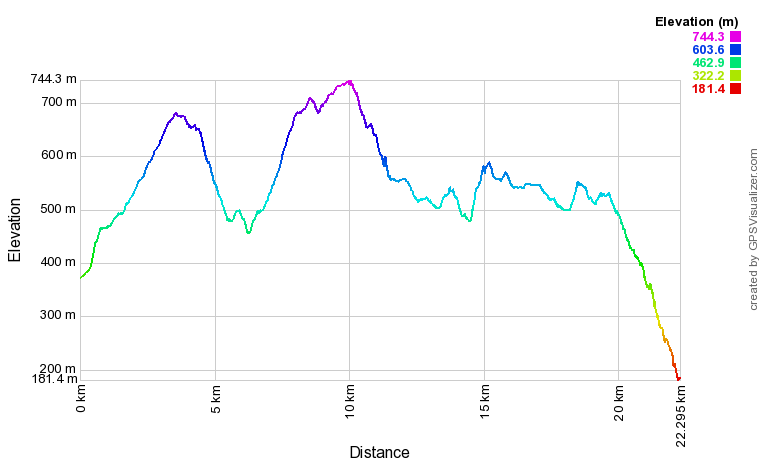

# Dag 2: 09/08/2019

## Aire St.Michel - Le Cros d' Utelle

Dag 2, voor ons het echte "vertrek".

Ik wordt 's ochtends gewekt door wat ik eerst voor een jogger hield.
Maar wie jogt er nu in hemelsnaam om 4u 's ochtends, terwijl het nog
pikdonker is? Ik schrok me te pletter toen het om een everzwijn bleek te
gaan dat op nog geen 5m van ons af rustig langsparadeerde om aan de
waterplek te gaan drinken :-/ Jammer genoeg lag ik te verstijfd in mn
slaapzak om er een foto van te nemen. 's Ochtends fotografeerde Dennis
wel deze enorme pad.

De eerste stapdag was shocktherapie: het was snikheet, we zweetten ons
te pletter.

In Levens vulden we water bij, en dronken wat bij Pizza du Stade

Daarna wandelen we door tot de rivier in het dal. Onderweg vertelde
iemand ons dat het daar goed bivakkeren was.

## Kaart & hoogteprofiel

[1](https://nl.wikiloc.com/routes-wandelen/gr5-l-aire-st-michel-cros-d-utelle-49744514%7CWikiloc)

[[docs/hiking/wandelverslagen/GR5/gr5_augustus2019_day1|Dag1]] \<\> [[docs/hiking/wandelverslagen/GR5/gr5_augustus2019_day3|Dag3]]

[//begin]: # "Autogenerated link references for markdown compatibility"
[docs/hiking/wandelverslagen/GR5/gr5_augustus2019_day1|Dag1]: gr5_augustus2019_day1 "Dag 1: 08/08/2019"
[//end]: # "Autogenerated link references"
